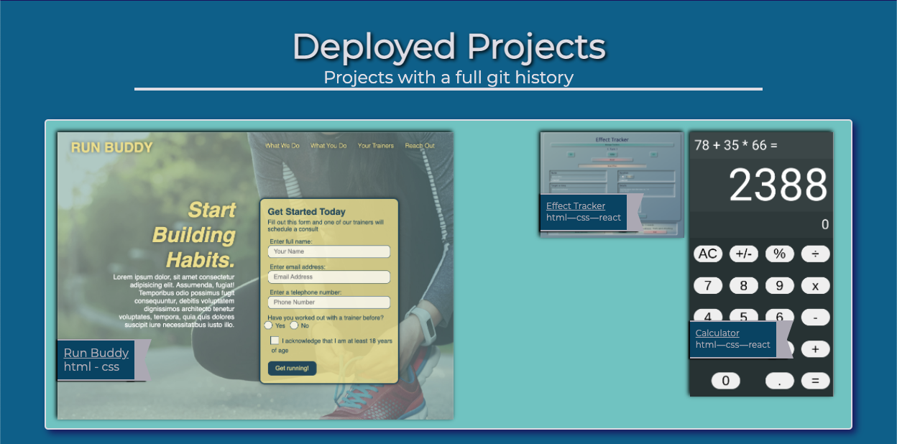

# Daniel Denton's Portfolio
Deployed page: [Daniel Denton's portfolio website](http://highdynamics.github.io)

## About Me
I started coding in 2019 and have taken great joy in putting pieces together and seeing them work. I'm currently enrolled in a coding bootcamp with Kansas University where I am learning to be a full-stack MERN developer.

## Deployed Projects
This section contains projects that are finished and deployed. They come with a git history to boot.

## Playground Projects
These projects were created for certification for [FreeCodeCamp's](http://www.freecodecamp.org) curriculum. They have no git history, and are included in 'playground' as they were all created in [codepen](http://codepen.io).

## Under Development
These projects are still a work in progress. I wanted to include them to showcase more complex or targeted work that I've done.
