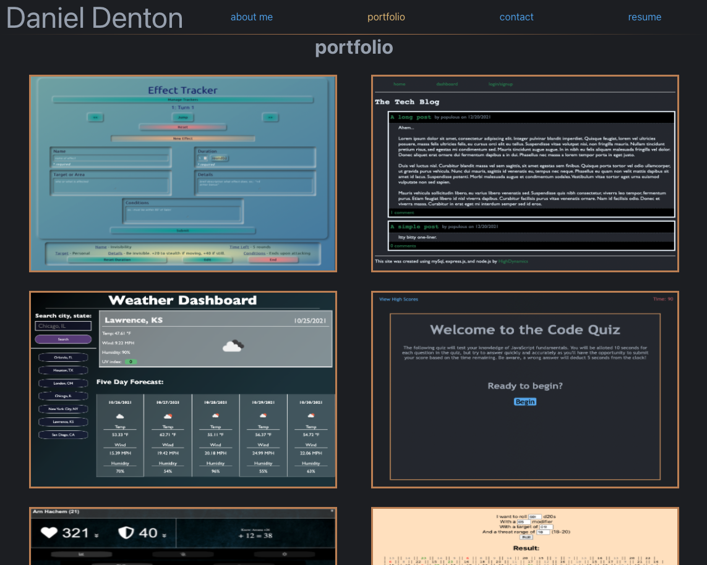

# Daniel Denton's Portfolio

Deployed page: [Daniel Denton's portfolio website](http://highdynamics.github.io)

## About Me

I started coding in 2019 and have taken great joy in putting pieces together and seeing them work. I'm currently enrolled in a coding bootcamp with Kansas University where I am learning to leverage the MERN stack.

Thanks for taking the time to take a look at my work!
